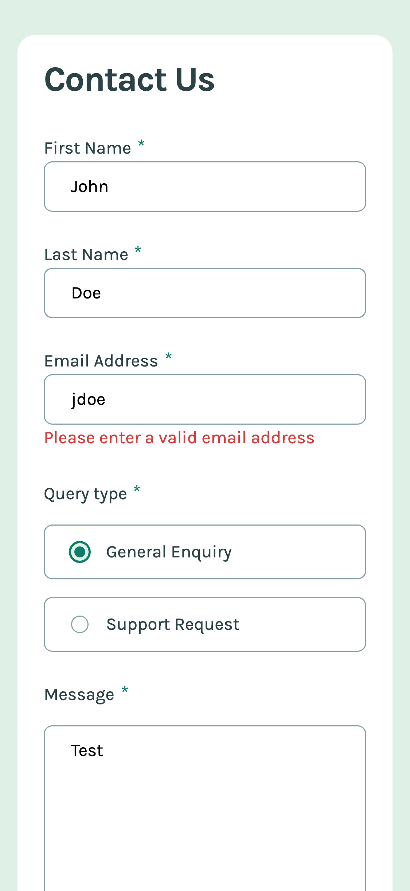
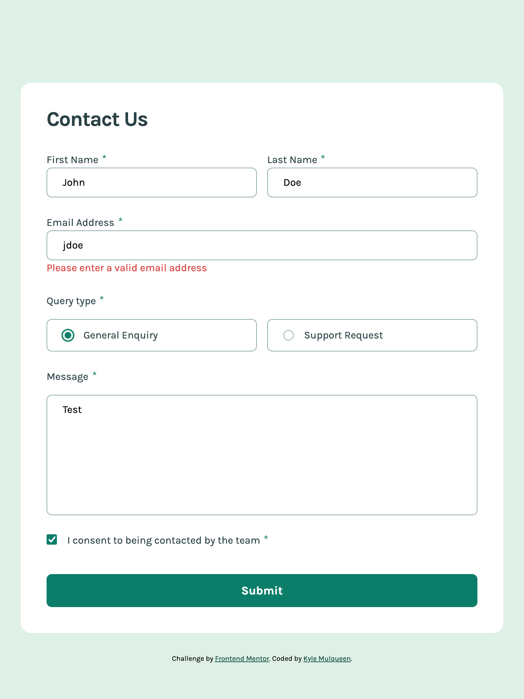
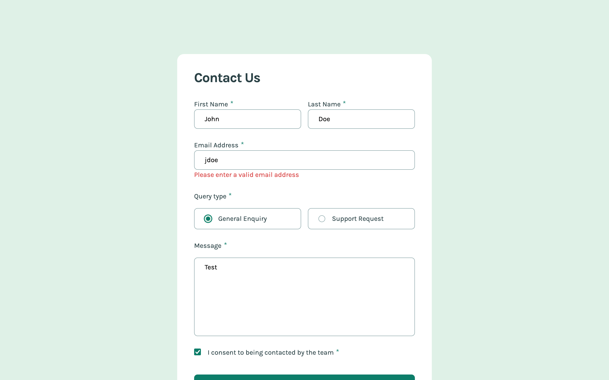

# Frontend Mentor - Contact form solution

This is a solution to the [Contact form challenge on Frontend Mentor](https://www.frontendmentor.io/challenges/contact-form--G-hYlqKJj). Frontend Mentor challenges help you improve your coding skills by building realistic projects.

## Table of contents

- [Frontend Mentor - Contact form solution](#frontend-mentor---contact-form-solution)
  - [Table of contents](#table-of-contents)
  - [Overview](#overview)
    - [The challenge](#the-challenge)
    - [Screenshot](#screenshot)
    - [Links](#links)
  - [My process](#my-process)
    - [Built with](#built-with)
    - [What I learned](#what-i-learned)
    - [Continued development](#continued-development)
    - [Useful resources](#useful-resources)
  - [Author](#author)

## Overview

### The challenge

Users should be able to:

- Complete the form and see a success toast message upon successful submission
- Receive form validation messages if:
  - A required field has been missed
  - The email address is not formatted correctly
- Complete the form only using their keyboard
- Have inputs, error messages, and the success message announced on their screen reader
- View the optimal layout for the interface depending on their device's screen size
- See hover and focus states for all interactive elements on the page

### Screenshot

**Mobile**

**Tablet**

**Desktop**

### Links

- Live Site URL: [GitHub Pages](https://kmulqueen.github.io/contact-form/)

## My process

### Built with

- JavaScript
- Semantic HTML5 markup
- CSS custom properties
- Flexbox
- CSS Grid
- Mobile-first workflow

### What I learned

Got more practice with client-side form validation. I tried using a Map this time to connect input elements with their error message elements, which made it cleaner to show error messages when validation failed. The approach worked well and felt more organized than what I've done before.

### Continued development

I want to keep working on form validation techniques. I should look into using a validation library next time instead of building everything from scratch - would probably save time and handle edge cases better.

### Useful resources

- [MDN Client-side form validation](https://developer.mozilla.org/en-US/docs/Learn_web_development/Extensions/Forms/Form_validation) - Good reference for HTML validation and the Constraint Validation API. Helped me understand how the built-in validation actually works.
- [Frontend Mentor JavaScript Fundamentals Learning Path](https://www.frontendmentor.io/learning-paths/javascript-fundamentals-oR7g6-mTZ-/steps/68099dc45fd8a24eb4ce4fca/article/read) - The FormData article was helpful for seeing how to capture form data and set up basic validation. Good high-level overview.

## Author

- Website - [Kyle's GitHub](https://github.com/kmulqueen)
- Frontend Mentor - [@kmulqueen](https://www.frontendmentor.io/profile/kmulqueen)
